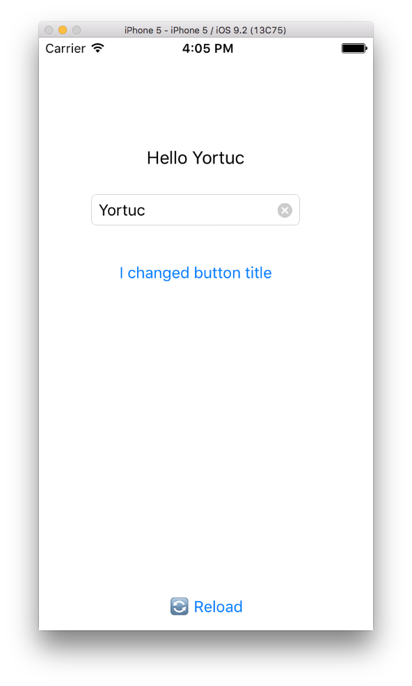

ScriptView
=====================



A tiny view control that lets you create sub contols and event handlers dynamically with javascript.

##Sample Script
**main.js**

```js

log("hello there!") // native logging

log("my width: " + RootView.getRect().width);   // root view properties

// create components
var myLabel = Label.create({
	rect: Rect.create({x: 50, y: 100, width:200, height:30}),
	text: "Welcome, please enter your username"
});

var firstButton = Button.create({
	title: "Example button",
	rect: Rect.create({x: 50, y: 200, width:200, height:50}),

	click: function() {
		log("Button clicked!");
		myLabel.text = "Logging in...";
	}
});

firstButton.title = "I changed button title";

log(firstButton.title);

var txtUserName = TextBox.create({
	placeholder: "my textbox",
	rect: Rect.create({x: 50, y: 150, width:200, height:30}),
	edited: function(value) {
		log("txtUserName edited. value: " + value);
		myLabel.text = "Hello " + txtUserName.text;
	}
});

var myView = View.create({
	rect: Rect.create({x: 40, y:280, width: 220, height: 200 }),
	backgroundColor: "#ffa500",
	borderRadius: 10,
	borderColor: "#000000"
});

var mySubView = View.create({
	rect: Rect.create({x: 5, y:40, width: 50, height: 50 }),
	backgroundColor: "#000000",
	borderRadius: 10
});

var subLabel = Label.create({
	rect: Rect.create({x: 0, y: 5, width:myView.rect.width, height:30}),
	text: "This is a child component!"
});

// add child views
myView.addChild(subLabel);
myView.addChild(mySubView);

```

##Roadmap
- XMLHTTPRequest implementation to extend JavascriptCore
https://github.com/Lukas-Stuehrk/XMLHTTPRequest

- SetTimeout implementation
https://github.com/Lukas-Stuehrk/WindowTimers

- CommonJS modules importer
https://github.com/evsukov89/jsc-require