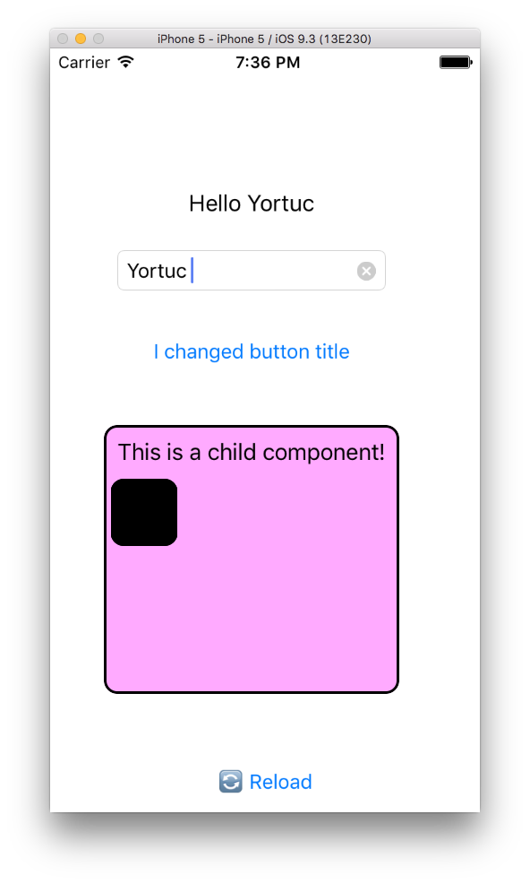

ScriptView
=====================



A tiny view control that lets you create sub contols and event handlers dynamically with javascript.

##Sample Script
```js
log("hello there!")

var firstButton = createButton({
	title: "Example button",
	x: 50,
	y: 100,
	width: 200,
	height: 50,
             
	click: function() {
    	log("Button clicked!");
	}
});

log(firstButton.title);

var myTextBox = createTextBox({
	placeholder: "my textbox",
	x: 50,
	y: 150,
	width: 200,
	height: 30,
	                           
	edited: function(value) {
		log("textbox edited. value: " + value);
	}
});

var myLabel = createLabel({
	x: 50,
	y: 200,
	width: 200,
	height: 30,
	text: "this is it!"
});
```